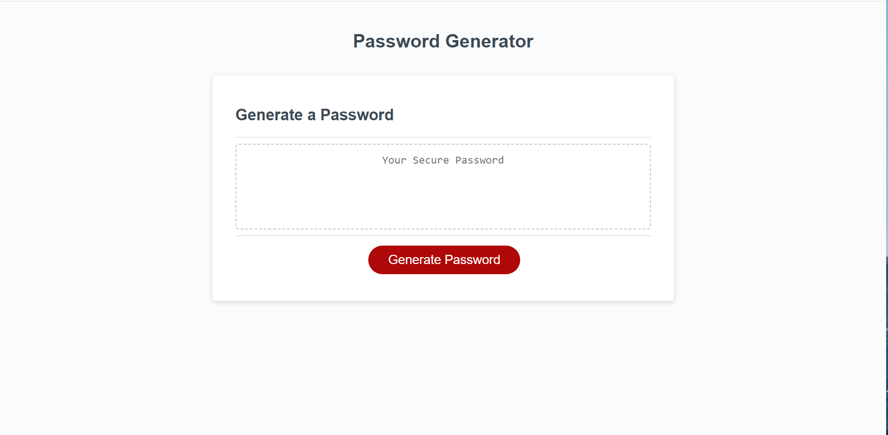
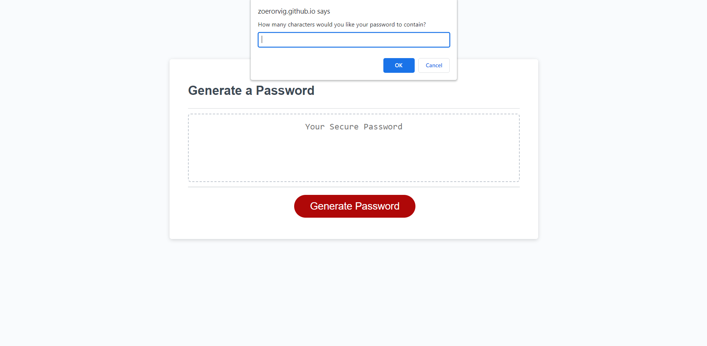
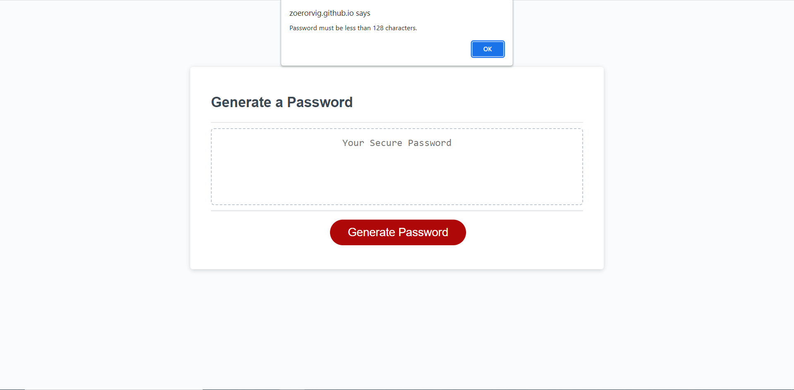
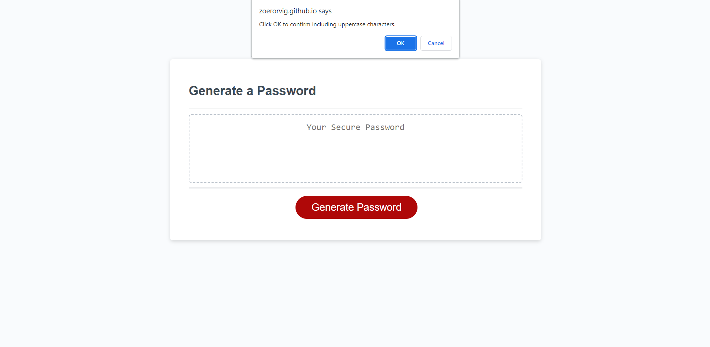
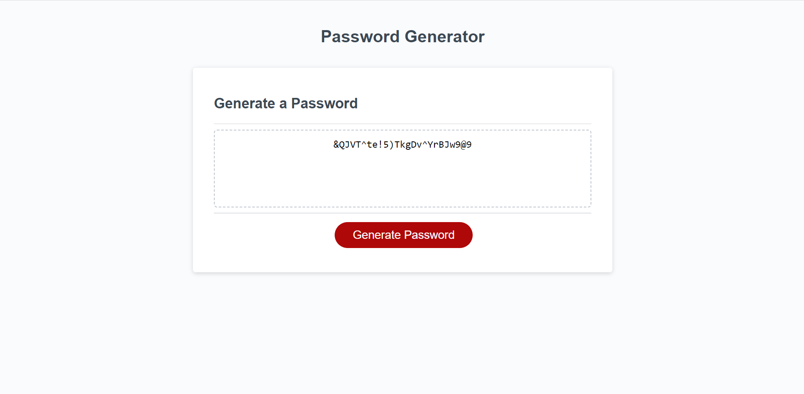

# password-generator

[Link to My Project](https://zoerorvig.github.io/password-generator/)

## Table of Contents
- [Description](#description)
- [Visuals](#visuals)

## Description 
This webpage is used to generate a random password. 

Features Include: 
- A "Generate Password" button to start the process. 
- A prompt for the length of the password, which must be between 8 to 128 characters. 
    - If prompt is canceled, then no password is generated and it returns to the main screen. 
    - Prompt: "How many characters would you like your password to contain?"
    - If the length is below 8 characters, it prompts "Password must be at least 8 characters."
    - If the length is above 128 characters, it prompts "Password must be less than 128 characters."
- A prompt for including special characters. 
    - Prompt: "Click OK to confirm including special characters."
- A prompt for including numeric characters. 
    - Prompt: "Click OK to confirm including numeric characters."
- A prompt for including lowercase characters. 
    - Prompt: "Click OK to confirm including lowercase characters."
- A prompt for including uppercase characters. 
    - Prompt: "Click OK to confirm including uppercase characters."
- A generated password that can be copied and pasted where it's needed. 
- If no characters were selected, "No Characters Selected" is displayed instead of a password.

## Visuals 

The following is a screenshot of the full webpage:

The following is a screenshot of the popup message for password length:

The following is a screenshot of the popup message for not enough characters:

The following is a screenshot of the popup message for too many characters:

The following is a screenshot of the popup message for the inclusion of special characters:

The following is a screenshot of the popup message for the inclusion of numeric characters:

The following is a screenshot of the popup message for the inclusion of lowercase characters:

The following is a screenshot of the popup message for the inclusion of uppercase characters:

The following is a screenshot of the generated password:

